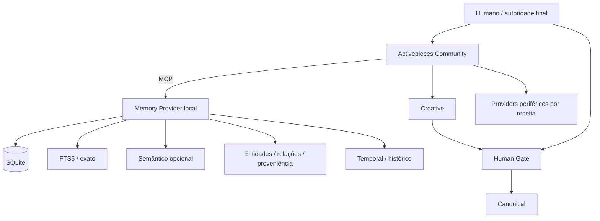

# Arquitetura vigente — núcleo mínimo substituível

> **Nota de vigência (2026-10-10):** As menções abaixo a Activepieces como executor ou componente por defeito documentam uma proposta anterior. A decisão posterior de 30-09-2026 em [DECISIONS.md](DECISIONS.md) e [STATUS.md](STATUS.md) retira Activepieces do núcleo obrigatório; o Conductor é candidato sujeito a testes. Preservamos o texto histórico para auditoria. Nenhuma ferramenta passa a ter autoridade sobre o Kernel ou o Human Gate.


## Estado

A arquitetura **conceptual** está estável. A composição física está em validação e não deve ser declarada fechada antes do teste comparativo do Memory Provider.

## Diagrama



## Responsabilidades

### Humano
É a única autoridade final. Aprova promoção a Canonical e ações protegidas.

### Activepieces
É o motor executivo, não o proprietário do conhecimento:
- flows/subflows;
- regras e estados de execução;
- Human Gate;
- recipes;
- MCP/HTTP;
- coordenação dos comparadores;
- chamadas a providers.

### Memory Provider
É o sistema de conhecimento local e substituível:
- SQLite/WAL;
- FTS5/BM25;
- pesquisa semântica quando necessária;
- temporalidade;
- entidades/relações;
- proveniência/eventos;
- histórico sem eliminação automática por similaridade.

Candidatos:
- A: RMANOV/sqlite-memory-mcp;
- B: Beledarian/mcp-local-memory.

Nenhum é aceite sem teste.

## Três memórias

São papéis lógicos, não três programas:
- Working: estado de execução Activepieces + contexto temporário;
- Behavioral/Procedural: regras/preferências/correções versionadas;
- Persistent Knowledge: conhecimento persistente no Memory Provider, distinguindo Creative de Canonical.

## Dois domínios

- Creative: propostas, hipóteses, variantes, contradições e material ainda não aprovado;
- Canonical: conhecimento explicitamente aprovado pelo humano.

A existência de uma função técnica chamada `promote` num provider não lhe dá autoridade. A chamada só pode ocorrer após Human Gate.

## Três comparadores

- determinístico/exato: regras, hashes, IDs, estados + FTS quando aplicável;
- semântico: embeddings/vector apenas quando necessário;
- relacional: entidades, relações, proveniência, versões e genealogia.

Os resultados são evidência. Nenhum comparador decide Canonical.

## Invariantes

- humano manda;
- IA/provider nunca aprova;
- similaridade/paráfrase nunca autoriza apagar;
- contradições são preservadas e sinalizadas;
- replay não volta a chamar IA/web para inventar evidência histórica;
- backup só é válido depois de restore demonstrado;
- provider swap não altera as leis;
- Internet desligada não deve destruir o núcleo;
- desmontar deve ser tão fácil como montar.

## Redundância

Não duplicar serviços por segurança aparente. A redundância é funcional:
- Activepieces guarda/processa execução;
- Memory Provider guarda conhecimento num formato SQLite portátil;
- exports/backups independentes permitem reconstrução;
- Canonical nunca depende de PiecesOS ou de uma cloud.

## PiecesOS

Não é núcleo. É proprietário e fica como benchmark/opção experimental. A geração 12.3.8/12.3.9 é interessante por LTM + MCP + FTS/vector/temporal, mas a arquitetura não pode depender do seu entitlement, cloud ou redistribuição.

## Providers periféricos

Zotero, LibreOffice, ComfyUI, LanguageTool, IA local, web, email e publicação entram apenas quando uma receita exige. Open Notebook/K-DLC deixam de ser runtime obrigatório.

## Regra de implementação

**LIGAR > CONFIGURAR > ADAPTAR > CRIAR.**

1. Activepieces já resolve?
2. Memory Provider já resolve?
3. MCP/API/CLI de provider maduro resolve?
4. configurar/adaptar minimamente;
5. criar código apenas perante FAIL demonstrado.

## Critério de desacoplamento

```
Remove(MemoryProvider) -> Activepieces + leis + configuração sobrevivem
Remove(Activepieces)   -> SQLite/Canonical + exports sobrevivem
Remove(AI)             -> conhecimento e autoridade sobrevivem
Internet=OFF           -> núcleo continua utilizável
```
