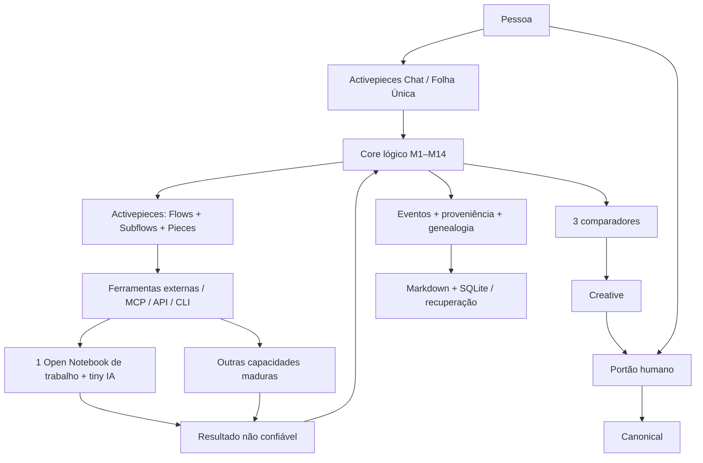

# Arquitetura vigente — Folha Única e M1–M14

A arquitetura conceptual mantém-se fechada. Esta página descreve a implementação operacional simplificada sem acrescentar módulos.

## Invariantes preservadas

- pessoa como autoridade final;
- três memórias: trabalho, comportamental/procedimental e conhecimento persistente;
- dois domínios de autoridade: Creative e Canonical;
- três comparadores: determinístico, semântico e relacional;
- M1–M14;
- proveniência, genealogia e contradições;
- regras versionadas e explicáveis;
- IA opcional, isolada e sem autoridade;
- nenhuma ferramenta externa escreve diretamente em Creative/Canonical;
- promoção para Canonical exige o portão humano aplicável;
- similaridade semântica nunca autoriza eliminação;
- replay/recuperação não inventam novamente evidência externa.

## Implementação mínima

O Core governa. Activepieces executa.

Por defeito, Open Notebook é uma única bancada cognitiva reutilizável. O Core escolhe as fontes/contexto relevantes para cada tarefa, limita o contexto entregue à tiny IA e recebe de volta resultado + evidência. O notebook não é memória autoritativa e não substitui Creative/Canonical.

Creative e Canonical podem usar a mesma mecânica física em Markdown/formatos abertos, mantendo fronteiras de autoridade distintas. SQLite serve IDs, relações, proveniência, genealogia, estados, permissões, eventos, FTS e índices; não é um terceiro cofre.

O registo de capacidades deve permanecer simples: `CAPACIDADE -> flow/subflow/provider`.

Activepieces pode usar Chat UI, routing, branching, Subflows, retries, waitpoints, webhooks, Pieces e MCP/API/CLI. Nenhum desses mecanismos decide conhecimento.

## Linguagem e flows

As regras humanas dos flows devem ser explicáveis em linguagem natural. Exemplo:

“Quando chegar uma fatura, liga-a ao contrato, regista a despesa e pergunta-me antes de marcar como concluída.”

A implementação técnica dessa regra pode mudar sem mudar o significado humano.

Famílias operacionais iniciais preferidas:

`RECEBER -> PESQUISAR -> TRABALHAR -> COMPARAR -> CRIAR -> VALIDAR -> APRESENTAR -> PEDIR_APROVAÇÃO -> EXECUTAR_AÇÃO -> REGISTAR`.

Criar micro-subflows apenas quando reduz repetição, melhora teste ou isolamento.

## Algoritmo da família de importação

Receber → validar → identificar operação/anexo → quarentena → hash → duplicação exata → formato → adaptador → tarefa delimitada → executar → resultado não confiável → validar envelope/conteúdo → classificar.

- READY: preparar candidato Creative e proveniência → eventos → materialização confirmada → derivados → apresentação.
- REVIEW: preservar ligação/evidência e apresentar revisão; sem Creative automático.
- FAILED: tratar falha; retry só com segurança demonstrada.
- Interrupção/incerteza: reconciliar; RECOVERY_REQUIRED bloqueia mutações incompatíveis.
- Eliminação: pedido humano separado → proposta → autorização específica → execução quando o contrato estiver fechado.

## Estado real

G10/IMP-019 continuam por fechar. Integração real Activepieces, sandbox, persistência Creative completa, promoção Creative→Canonical, eliminação final, Windows e E2E continuam a exigir implementação e teste.

[Prompt mestre](docs/baseline/CEREBRO_PROMPT_MESTRE_CURSOR_2026-09-26.md) · [Arquitetura operacional](docs/ARQUITETURA-OPERACIONAL-ADAPTATIVA.md) · [Matriz de conformidade](docs/MATRIZ-CONFORMIDADE.md) · [Compatibilidade](COMPATIBILITY-MATRIX.md).
