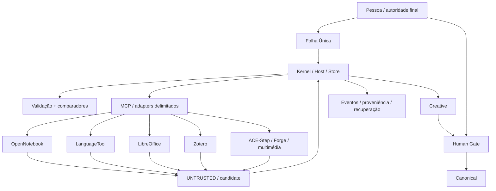

# Arquitetura vigente — Kernel estável, capacidades substituíveis

## Estado

A arquitetura conceptual está fechada. O runtime candidato atual é Kernel/Host/Store Python com despacho interno direto protegido e MCP determinístico opcional para ferramentas externas delimitadas. A PR #32 é a baseline candidata Windows; a PR #45 reúne uma integração posterior isolada Draft, sem release aprovada. Revalidar estado pelo SHA exato.

## Diagrama



## Responsabilidades

### Pessoa
Única autoridade final. Aprova promoções e ações protegidas.

### Kernel / Host / Store
É o cérebro determinístico/constitucional:
- identidade e estado;
- regras e invariantes;
- seleção de processo/capability;
- Creative e Canonical;
- Human Gate;
- proveniência direta e inversa;
- eventos, integridade, recovery e replay;
- validação de outputs externos;
- confinamento dos processos que lança.

### MCP
Transporte determinístico **opcional** quando a integração exigir protocolo externo; o runner interno não faz relay MCP universal:
- allowlist de tools;
- argumentos delimitados;
- timeouts e limites;
- zero autoridade;
- zero Store/Canonical direto.

### Ferramentas externas
Executam capacidades especializadas e devolvem candidatos. Não governam o Nexus.

Exemplos: OpenNotebook, LanguageTool, LibreOffice, Zotero, ACE-Step, Forge, FFmpeg, Whisper/TTS e modelos locais.

## Três memórias

Papéis lógicos, não três programas:
- Working;
- Behavioral/Procedural;
- Persistent Knowledge, com Creative e Canonical.

## Três comparadores

- determinístico/exato;
- semântico;
- relacional/proveniência.

Nenhum comparador decide Canonical.

## Adaptabilidade

Adicionar capacidade não deve redesenhar o núcleo:

`nova ferramenta → adapter/contrato → MCP/runner → Kernel valida → Creative → humano → Canonical`.

A ferramenta deve ser substituível. Se a remoção de uma capability destrói a memória ou a autoridade do sistema, está mal integrada.

## Windows

O Host limita processos que lança através da fronteira nativa candidata. Verificar código, ambiente e gates no mesmo SHA; a leitura documental não certifica a fronteira física. Isso não significa controlo total sobre todo o Windows nem sobre processos externos iniciados fora do Host.

Provisioning externo permanece um gate separado: recusa segura não equivale a instalação protegida funcional.

## Alcance da Folha pública no SHA auditado

O parser distingue sete intenções e o runner define dez processos internos, mas a API normal só aceita proposta natural `verify` com anexo e confirmação pré-execução. A confirmação para Canonical é posterior e distinta. Ver [auditoria de compatibilidade de 10/10](docs/10-current/COMPATIBILIDADE-CODIGO-2026-10-10.md).

## Genealogia

[Decisões e razões](docs/40-decisions/README.md) · [História](docs/99-history/README.md) · [Matriz de PRs](docs/60-evidence/MATRIZ-PRS-2026-10-10.md). [Issue #42](https://github.com/PAPACREATOR/cerebro-parvo-/issues/42): OpenNotebook especializado, selecionado por tarefa.

Activepieces, Memory Provider, Spiff e Conductor foram etapas reais da investigação e implementação. Permanecem em `DECISIONS.md`, `historico/` e relatórios. Não são runtime obrigatório atual.

## Critério de desacoplamento

```text
Remove(AI)              -> autoridade e conhecimento sobrevivem
Remove(OpenNotebook)    -> Creative/Canonical/proveniência sobrevivem
Remove(LibreOffice)     -> documentos e memória sobrevivem; capability fica indisponível
Remove(MCP tool)        -> Kernel bloqueia a capability, não perde estado
Internet=OFF            -> núcleo continua utilizável
```
