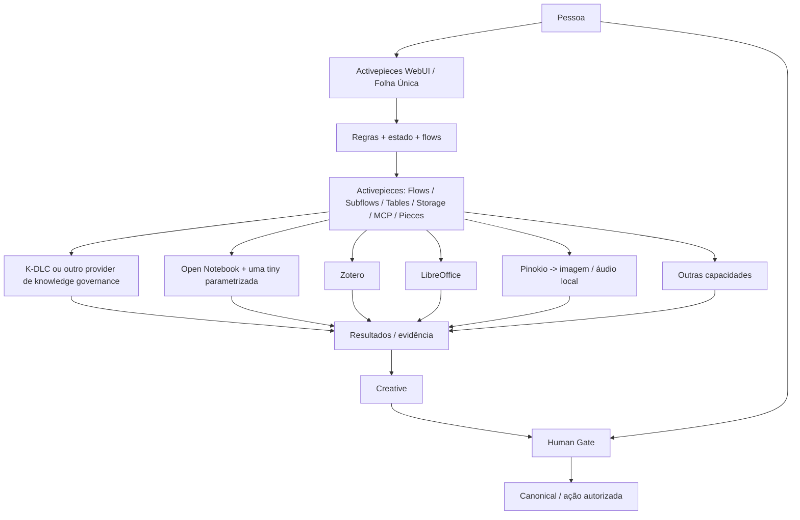

# Arquitetura vigente — composição mínima governada

A arquitetura conceptual continua fechada. A implementação operacional foi simplificada ao mínimo: **não construir mecanismos próprios quando uma capacidade madura já produz o comportamento necessário**.



## O que é nosso

O Cérebro não é definido por um programa específico. É definido por invariantes:

- pessoa como autoridade final;
- três memórias: trabalho, comportamental/procedimental e conhecimento persistente;
- dois domínios de autoridade: Creative e Canonical;
- três comparadores: determinístico, semântico e relacional;
- M1–M14 como responsabilidades;
- proveniência, genealogia e contradições;
- regras versionadas e explicáveis;
- IA sem autoridade;
- Human Gate para promoção/ações protegidas;
- similaridade semântica nunca autoriza eliminação;
- replay/recuperação não volta a inventar evidência externa.

## O que deixa de ser obrigatório

- Core Python separado;
- SQLite no MVP;
- motor de workflows próprio;
- motor de pesquisa próprio;
- vários agentes permanentes;
- frontend próprio;
- adaptadores próprios quando Piece/MCP/API/CLI resolve.

O “Core” passa a significar a **função constitucional**: regras, estados, permissões e autoridade. Sempre que possível, esta função é expressa com Activepieces Flows/Subflows, Tables/Storage e configuração.

SQLite ou Python só entram se um teste real demonstrar uma lacuna que as capacidades existentes não conseguem fechar.

## Três memórias

Implementação preferencial inicial:

- Working Memory -> estado do flow + Tables/Storage;
- Behavioral/Procedural Memory -> Tables versionadas com regras, preferências e correções;
- Persistent Knowledge -> Creative/Canonical em formatos abertos, com provider de governação quando útil.

Estas são funções de memória, não três produtos nem três bases de dados.

## Três comparadores

Podem ser providers independentes:

- determinístico -> condições, hashes, estados, valores, regras;
- relacional -> relações, backlinks, fontes, versões, genealogia, índices;
- semântico -> Open Notebook/tiny ou outro provider.

O flow cruza os resultados. Nenhum comparador promove Canonical sozinho.

## Capacidades

Registo conceptual mínimo:

```
CAPACIDADE -> PROVIDER
SEMANTIC_WORK -> Open Notebook
KNOWLEDGE_GOVERNANCE -> K-DLC (se compatível)
REFERENCES -> Zotero
DOCUMENT_OUTPUT -> LibreOffice
IMAGE -> Pinokio/provider local
AUDIO_MUSIC -> Pinokio/provider local
PUBLISH -> Piece/provider aplicável
```

O provider pode mudar sem alterar as leis do Cérebro.

## Regra permanente de implementação

**LIGAR > CONFIGURAR > ADAPTAR > CRIAR.**

Não adicionar serviço, base de dados, agente, biblioteca ou aplicação enquanto um flow + provider existente cumprir o comportamento requerido.

## Critério de produto

Para o utilizador deve existir uma única experiência:

```
Pessoa
-> Activepieces WebUI
-> pedido normal
-> flow escolhe capacidades
-> ferramentas trabalham nos bastidores
-> resultado volta
-> Creative / aprovação humana / Canonical
```

O utilizador não deve ter de circular entre aplicações para completar o processo.

## Estado real

Esta arquitetura está agora fechada como direção operacional. Ainda falta provar a composição numa vertical slice real em Activepieces. O código histórico e o writer recuperável permanecem como evidência/alternativa técnica, mas deixam de ser pressuposto obrigatório do MVP.
