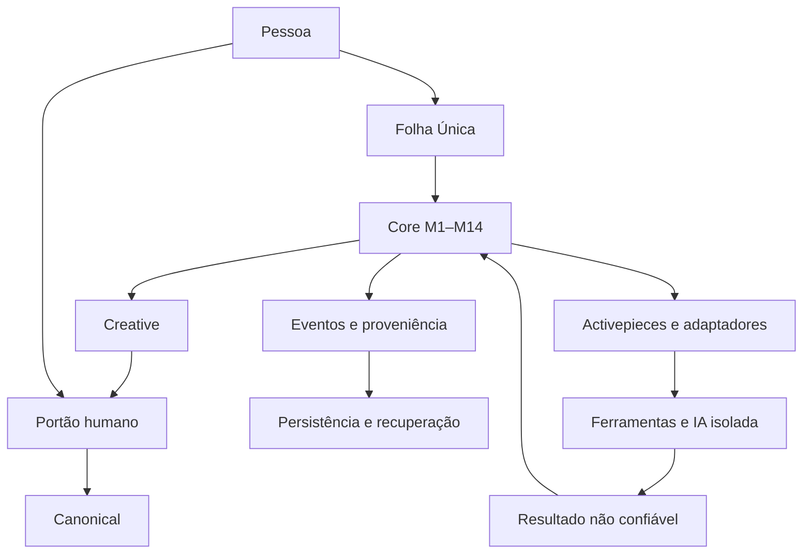

# Arquitetura vigente — Folha Única e M1–M14

A arquitetura mantém-se fechada. Esta página organiza a baseline de 26/09; não acrescenta módulos nem decisões de produto.

A linha Creative → portão → Canonical descreve a autoridade, não uma transferência que apague Creative. As operações persistentes obedecem ao contrato de eventos/recibos aplicável; G10 e IMP-019 ainda não estão fechados.

Folha: `@@` arquivo; `@` web; `""` fontes; `&` trabalhar; `??` perguntar; `%` calcular; `#` tema. São sinais opcionais; texto normal continua permitido. UI não decide conhecimento.

M1 identidade; M2 documentos/blocos; M3 versões/genealogia; M4 Creative; M5 Canonical; M6 portão humano; M7 relações; M8 proveniência/fontes; M9 contradições; M10 pesquisa/recuperação; M11 regras; M12 EventLog/auditoria; M13 integridade/recuperação; M14 coordenação/iniciativa.

## Algoritmo da família de importação

Receber → validar → identificar operação/anexo → quarentena → hash → duplicação exata → formato → adaptador → tarefa delimitada → executar → resultado não confiável → validar envelope/conteúdo → classificar.

- READY: preparar candidato Creative e proveniência → eventos → materialização confirmada → derivados → apresentação.
- REVIEW: preservar ligação/evidência e apresentar revisão; sem Creative automático.
- FAILED: tratar falha; retry só com segurança demonstrada.
- Interrupção/incerteza: reconciliar; RECOVERY_REQUIRED bloqueia mutações incompatíveis.
- Eliminação: pedido humano separado → proposta → autorização específica → execução quando o contrato estiver fechado.

Esta família não é o catálogo completo de todas as funções M1–M14. Pesquisa, cognição adaptativa, aprendizagem operacional, versões, relações e promoção humana exigem contratos e testes próprios.

## Stack e fronteiras

Python-first; SQLite/FTS5 quando aplicável; Markdown/formatos abertos; Activepieces para execução operacional; LibreOffice, Zotero e LanguageTool como capacidades delimitadas; IA opcional e isolada. Second-Brain é candidato a mecanismos de persistência/recovery, não integração já demonstrada. Joplin e Logseq ficam na genealogia e como referências de mecanismos, sem serem interface obrigatória.

[Prompt mestre](docs/baseline/CEREBRO_PROMPT_MESTRE_CURSOR_2026-09-26.md) · [Matriz de conformidade](docs/MATRIZ-CONFORMIDADE.md) · [Compatibilidade](COMPATIBILITY-MATRIX.md).
