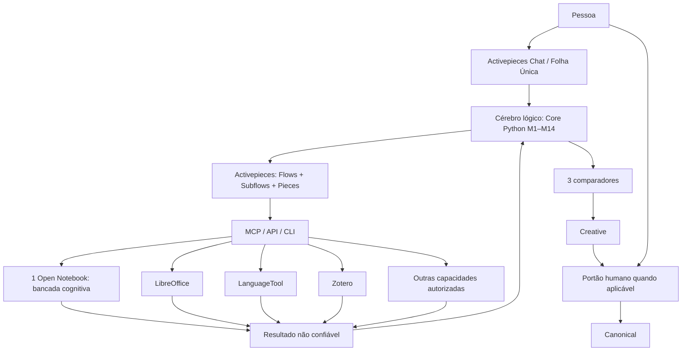

> **Documento histórico datado.** Conserva a análise desta fase e não define o runtime atual. Para implementação vigente consultar [CEREBRO_ARCHITECTURE.md](../CEREBRO_ARCHITECTURE.md), [DECISIONS.md](../DECISIONS.md) e [PONTO-DE-SITUACAO](../nexus/docs/PONTO-DE-SITUACAO.md).

# Arquitetura operacional adaptativa

Estado: refinamento operacional aprovado em 28-09-2026. Não cria M15 nem substitui M1–M14. Implementa a arquitetura fechada com o mínimo de código próprio e máxima reutilização de componentes maduros.

## Princípio

O Cérebro mantém a autoridade e as regras. Activepieces/Pieces constituem a oficina operacional preferencial. Open Notebook funciona, por defeito, como uma única bancada cognitiva temporária. Ferramentas externas são capacidades substituíveis.

A simplificação altera o método de implementação, não as invariantes: três memórias, Creative/Canonical, três comparadores, proveniência, genealogia, contradições, eventos, recuperação, portão humano e autoridade final da pessoa mantêm-se.

## Quatro responsabilidades

### 1. Cérebro lógico

O Core decide **o que pode/deve acontecer** e conserva apenas o que é próprio do sistema:

- M1–M14;
- três memórias: trabalho, comportamental/procedimental e conhecimento persistente;
- Creative e Canonical como classes de autoridade distintas;
- três comparadores: determinístico, semântico e relacional;
- identidade, contexto, regras, prioridades e permissões;
- proveniência, genealogia e contradições;
- seleção da capacidade;
- validação de resultados externos;
- eventos, recibos, replay e recuperação;
- explicação auditável da decisão.

O Core não reimplementa motores maduros de workflow, pesquisa documental, edição, referências, língua ou multimédia.

### 2. Activepieces / Pieces

Activepieces é o método padrão para **executar** trabalho autorizado:

- Chat UI/Folha Única quando adequado;
- triggers e schedules;
- routing e branching;
- Subflows reutilizáveis;
- retries e waitpoints;
- webhooks;
- Pieces;
- chamadas MCP/API/CLI;
- transporte entre capacidades externas.

Regra: **Activepieces executa; o Cérebro governa.**

Um Flow, Subflow, Piece, trigger, relógio ou waitpoint nunca ganha autoridade sobre Creative, Canonical, permissões ou decisão humana.

As regras humanas dos flows devem permanecer legíveis em linguagem natural. A implementação técnica pode ser um Flow/Subflow, mas deve existir uma explicação equivalente do tipo: “quando X acontecer, faz Y; antes de Z, pergunta-me”.

### 3. Uma bancada cognitiva Open Notebook

Por defeito existe **um único notebook de trabalho reutilizável**, não um agente/notebook permanente por domínio.

Fluxo:

`pedido -> Cérebro escolhe contexto/fontes -> Activepieces chama Open Notebook -> tiny IA trabalha -> resultado + fontes -> Cérebro valida -> contexto da tarefa é libertado/trocado`.

O notebook não é memória autoritativa nem cofre. É uma oficina cognitiva.

A mesma tiny IA pode trabalhar sucessivamente em contexto jurídico, financeiro, escrita ou outro. Não transporta autoridade nem memória oculta entre tarefas. Quem conserva relações e memória persistente é o Cérebro.

### 4. Dois cofres, uma mecânica simples

Creative e Canonical mantêm-se separados por autoridade, não precisam de dois motores tecnológicos diferentes.

Implementação preferencial:

- conteúdo humano persistente em Markdown/formatos abertos;
- SQLite para IDs, relações, proveniência, genealogia, estados, permissões, eventos, FTS e índices;
- Creative preserva hipóteses, alternativas, rascunhos, erros, rejeições e contradições;
- Canonical conserva a versão atualmente aprovada/consolidada pela pessoa;
- promoção para Canonical não apaga Creative nem genealogia.

SQLite não é um terceiro cofre.

## Contexto mínimo e tiny IA

A tiny IA recebe apenas o necessário para a tarefa.

O Cérebro seleciona fontes antes da chamada através de regras, FTS, relações, datas, proveniência e ranking. O notebook pode conhecer muitas fontes, mas a execução da tiny recebe um subconjunto limitado.

Regra operacional inicial, configurável e sujeita a teste:

- começar com um lote pequeno de fontes relevantes;
- se a evidência for insuficiente, pedir/selecionar novo lote;
- não despejar automaticamente todo o notebook/contexto na tiny;
- registar quais fontes/contexto sustentaram o resultado.

O número concreto não é uma invariável arquitetónica. Deve ser definido por testes do modelo, tamanho das fontes e tarefa.

## Três comparadores

Resultados do notebook e de qualquer ferramenta regressam ao Core como não confiáveis.

O Core pode classificá-los, conforme evidência, como:

- confirma;
- complementa;
- contradiz;
- insuficiente.

A decisão resulta do cruzamento adequado dos três comparadores:

- determinístico/matemático;
- semântico;
- relacional.

Concordância entre comparadores não promove automaticamente Canonical.

## Uma porta para resultados externos

Todas as capacidades externas devem convergir num envelope mínimo comum, por exemplo:

- `operation_id`;
- capacidade;
- ferramenta/versão;
- resultado;
- evidência/fontes;
- avisos;
- estado.

Tudo chega como `UNTRUSTED` até validação do Core. Esta regra evita validadores especiais e autoridade implícita por ferramenta.

## Capacidades, não fornecedores

O Core conhece capacidades. A implementação concreta pode mudar.

Exemplos:

- `RESEARCH_SOURCES` -> Open Notebook;
- `DOCUMENT_EDIT` -> LibreOffice;
- `GRAMMAR_CHECK` -> LanguageTool;
- `REFERENCE_MANAGER` -> Zotero;
- `TRANSCRIBE` -> Whisper;
- `GENERATE_IMAGE` -> ferramenta autorizada.

O registo de capacidades deve começar simples: uma tabela/configuração `CAPACIDADE -> flow/subflow/provider`, não um subsistema novo.

## Linguagem natural sem LLM obrigatório

A interpretação segue escalada progressiva:

1. prefixos e comandos explícitos;
2. regras, padrões, tabelas e estado;
3. correspondência aproximada/fuzzy e decomposição tipo ELIZA;
4. contexto persistente já aprovado;
5. tiny/local apenas para ambiguidade residual;
6. modelo maior ou serviço externo apenas quando necessário e autorizado.

A IA nunca é requisito para o circuito normal.

## Famílias de flows

Não começar com centenas de flows próprios. Começar com poucas famílias reutilizáveis e compor Pieces maduras:

- RECEBER;
- PESQUISAR;
- TRABALHAR;
- COMPARAR;
- CRIAR;
- VALIDAR;
- APRESENTAR;
- PEDIR_APROVAÇÃO;
- EXECUTAR_AÇÃO;
- REGISTAR.

Micro-subflows aparecem apenas quando reduzem repetição, melhoram teste ou isolamento. Não duplicar no Activepieces regras que pertencem ao Core.

## Regra de seleção técnica

Antes de escrever código:

1. procurar Piece/Flow/Subflow maduro;
2. procurar MCP/API/CLI do programa externo;
3. verificar licença, manutenção, segurança e compatibilidade;
4. preferir ligação fina a fork/reimplementação;
5. manter autoridade e invariantes no Core;
6. testar a fronteira;
7. criar código próprio apenas quando a função não existe ou não preserva o contrato.

Regra resumida: **usar > adaptar > criar**.

## Evolução controlada

Regras, flows, capacidades e configurações podem evoluir por processo versionado:

`observar -> pesquisar -> comparar -> propor -> autorização humana -> testar isoladamente -> PASS -> ativar nova versão -> preservar anterior`.

Nova versão não apaga a antiga. Deve existir rollback.

O Cérebro pode pesquisar alternativas e preparar propostas. Instalar, substituir, remover, promover conhecimento ou aumentar permissões segue o portão humano aplicável.

## Pontos ainda não resolvidos

Esta simplificação não declara concluídos os bloqueios existentes:

- G10 / IMP-019: protocolo autoritativo de eventos, materialização, recibos e crash recovery;
- integração real Core ↔ Activepieces;
- sandbox/isolamento real;
- persistência Creative completa;
- promoção Creative → Canonical;
- política final de eliminação/retention;
- testes ponta-a-ponta e Windows.

Esses pontos devem ser resolvidos pela implementação mais simples que satisfaça os contratos existentes, sem reabrir a arquitetura conceptual.
