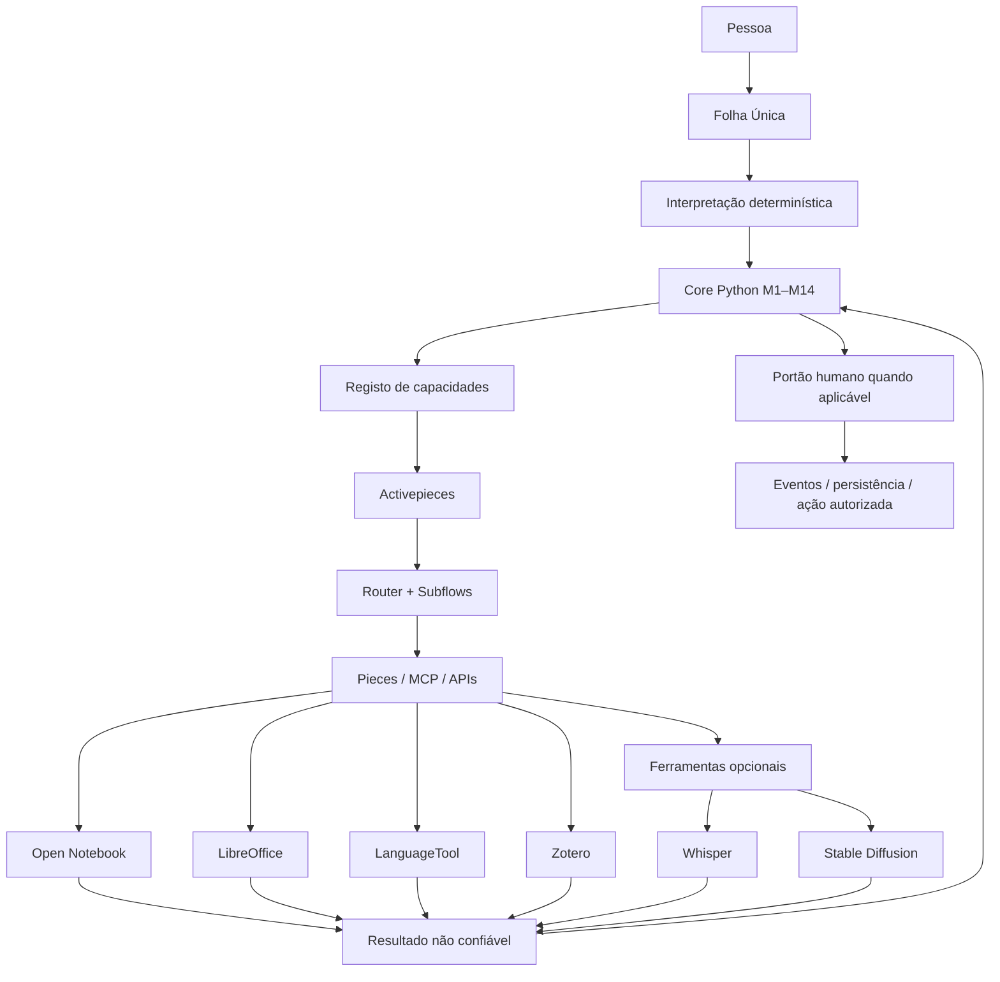

# Arquitetura operacional adaptativa

Estado: refinamento operacional aprovado em 27-09-2026. Não cria M15 nem substitui M1–M14. Define como implementar a arquitetura fechada com o mínimo de código próprio.

## Princípio

O Cérebro é um núcleo determinístico pequeno. Ferramentas externas são capacidades substituíveis. Tudo está ligado pelo mesmo circuito, mas cada ferramenta recebe apenas o contexto, permissões e dados necessários à sua função.

## Fronteira de responsabilidades

### Core Python

O Core decide **o que deve acontecer**. Conserva:

- estado, identidade e contexto;
- M1–M14;
- regras, prioridades e permissões;
- Creative/Canonical e portões humanos;
- proveniência, genealogia e contradições;
- escolha de capacidade;
- validação do resultado;
- eventos, recibos e recuperação;
- explicação auditável da decisão.

O Core não implementa de raiz capacidades maduras já disponíveis externamente.

### Activepieces

Activepieces decide **como executar a sequência operacional autorizada**:

- routing e branching;
- subflows reutilizáveis;
- triggers e schedules;
- retries e waitpoints;
- webhooks;
- integrações;
- transporte entre capacidades;
- chamadas MCP determinísticas.

Nenhum flow, Piece ou waitpoint ganha autoridade epistemológica ou de aprovação.

### Capacidades

O Core conhece capacidades, não fornecedores fixos.

Exemplos:

- `DOCUMENT_EDIT` -> LibreOffice;
- `RESEARCH_SOURCES` -> Open Notebook;
- `GRAMMAR_CHECK` -> LanguageTool;
- `REFERENCE_MANAGER` -> Zotero;
- `TRANSCRIBE` -> Whisper opcional;
- `GENERATE_IMAGE` -> Stable Diffusion opcional.

Uma ferramenta pode ser substituída sem alterar a semântica do Core desde que cumpra o mesmo contrato.

## Linguagem natural sem LLM obrigatório

A interpretação segue escalada progressiva:

1. prefixos e comandos explícitos;
2. regras, padrões, tabelas e estado;
3. correspondência aproximada/fuzzy e decomposição tipo ELIZA;
4. contexto persistente já aprovado;
5. modelo tiny/local apenas para ambiguidade residual;
6. modelo maior ou serviço externo apenas quando necessário e autorizado.

A IA nunca é requisito para o circuito normal.

## Processos e subprocessos

Todo trabalho é composto por processos hierárquicos:

`processo -> subprocesso -> ação -> resultado -> validação -> próximo estado`.

Um subprocesso nunca recebe mais autoridade do que o processo que o chamou.

Ações críticas seguem:

`PROPOR -> AUTORIZAR -> EXECUTAR -> VERIFICAR -> REGISTAR`.

Sem autorização válida, a ação fica pendente ou é cancelada.

## Evolução controlada

Nada é tratado como eternamente verdadeiro por conveniência. Regras, flows, capacidades e configurações podem evoluir, mas apenas por processo versionado:

`observar -> detetar oportunidade -> pesquisar -> comparar -> propor -> autorização humana -> testar isoladamente -> PASS -> ativar nova versão -> preservar anterior`.

Nova versão não apaga a antiga. Deve existir rollback.

O Cérebro pode pesquisar alternativas, Pieces, bibliotecas e ferramentas. Pode preparar uma proposta. Não pode instalar, substituir, remover ou promover componentes críticos sem autorização humana explícita.

## Kit base e extensões

Kit base recomendado, não obrigatório:

- Cérebro;
- Activepieces;
- LibreOffice;
- Open Notebook;
- LanguageTool;
- Zotero.

Extensões opcionais são instaladas conforme a pessoa: Whisper, Stable Diffusion, email, calendário, banca read-only, publicação, redes, multimédia ou outros Pieces.

O produto não é uma configuração pessoal fixa. O Core permanece igual; mudam perfil, linguagem, conhecimento, ferramentas ligadas, contas, permissões, rotinas e objetivos.

## Regra de simplicidade

Antes de escrever código novo:

1. verificar se uma capacidade madura já existe;
2. verificar licença, manutenção, segurança e compatibilidade;
3. preferir adaptador fino a reimplementação;
4. manter regras de autoridade no Core;
5. testar a fronteira;
6. preservar substituibilidade.

O objetivo é maximizar composição e minimizar código próprio fora daquilo que torna o Cérebro único.
