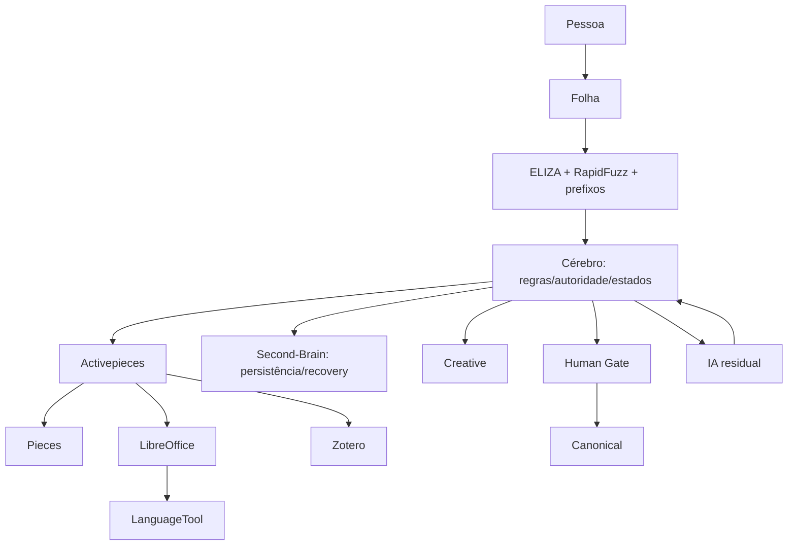

# CÉREBRO — implementação executável inicial

Arquitetura conceptual congelada. Este pacote traduz IMP-001–026 em código de contrato e testes sem inventar decisões marcadas POR DEFINIR.

## Diagrama

## Algoritmo
RECEIVE → VALIDATE → operation_id → attachment_id → QUARANTINE → SHA256 → EXACT_DUPLICATE → FORMAT → ADAPTER → TASK → ACTIVEPIECES → UNTRUSTED_RESULT → ENVELOPE → CONTENT_VALIDATION → READY/REVIEW/FAILED.
READY → Creative candidate → Provenance → Events → Materialize → Derivatives → Present.
REVIEW → Present sem Creative automático. FAILED → Failure. Incerteza/crash → Reconcile.
Eliminação é separada: Proposal → Human Authorization → Delete.

## Vencedores e cortes
- stdlib: uuid, hashlib, sqlite3, pathlib, tempfile, shutil, json, re.
- Python externo planeado: Pydantic, RapidFuzz, DeepDiff, rule-engine, pytest, Hypothesis.
- Activepieces: workflows, Pieces, HTTP/API, webhooks, schedules, retries/branches/loops, waitpoints, integrações, PDF mecânico, fronteira de IA.
- Second-Brain: candidato principal a storage/FTS/relações/lock/receipt/journal/snapshot/recovery.
- LibreOffice: documentos profissionais. Zotero: fontes/bibliografia. LanguageTool: língua.
- Open-Self/Portable-KB/dogankoc: apenas recortes que preencham lacuna sem duplicar.
- ELIZA: somente keyword/rank/decomposition/reassembly.
- Rejeitados inicialmente por duplicação: ORM, vector DB, RAG framework, NetworkX, Portalocker, Tenacity, Watchdog, Lingua, requests/httpx no Core, bibliotecas PDF redundantes.

## IMP-001–026
001 receive: implementado.
002 validate: implementado, limites são configuração obrigatória.
003 operation_id: implementado; persistência G10 ainda aberta.
004 attachment_id: implementado; persistência G10 ainda aberta.
005 quarantine: implementação atómica inicial com ficheiro parcial + os.replace.
006 hash: hashlib SHA-256 implementado.
007 exact duplicate: digest + confirmação byte-a-byte implementados.
008 format: PDF/PNG/JPEG/ZIP/DOCX/EPUB por conteúdo; desconhecido fica desconhecido.
009 adapter: registry implementado; conflito exige prioridade explícita.
010 task: envelope mínimo implementado; timeout obrigatório.
011 execute: fronteira Activepieces implementada como adapter; workflow real fica no Activepieces.
012 result: correlação e estado UNTRUSTED implementados.
013 envelope: validação mínima implementada; schema final continua aberto.
014 content: sanity check mínimo; validadores específicos ainda dependem da capacidade/formato.
015 classify: motor recebe regra determinística explícita; sem regra falha fechado.
016 Creative: só READY produz candidato; não promove Canonical.
017 provenance: cadeia mínima implementada.
018 events: preparação de evento implementada; G10 continua aberto.
019 materialize: deliberadamente bloqueado até fechar G10/protocolo de commit.
020 derivatives: estado UPDATED/DIRTY implementado; FTS será reconstruível.
021 present: mensagens simples sem transformar apresentação em aprovação.
022 failure: FAILED/RETRYABLE/RECOVERY_REQUIRED.
023 reconcile: COMMITTED apenas com receipt + hash verificado; NOT_COMMITTED apenas com prova; resto RECOVERY_REQUIRED.
024 deletion proposal: não elimina.
025 human authorization: alvo específico + actor HUMAN.
026 delete: deliberadamente bloqueado até definir original/backup/retenção.

## POR DEFINIR preservados
G10/fronteiras transacionais; limites IMP-002; confiança/formato IMP-008; prioridade IMP-009; limites/sandbox 010–011; schema 013; métricas 014–015; protocolo 019; pesquisa com derivados sujos 020; retenção/backup e significado de original 024/026.

## Regra de fecho
PASS real ou não está fechado. FAIL/SKIP/NOT RUN nunca contam como PASS.
